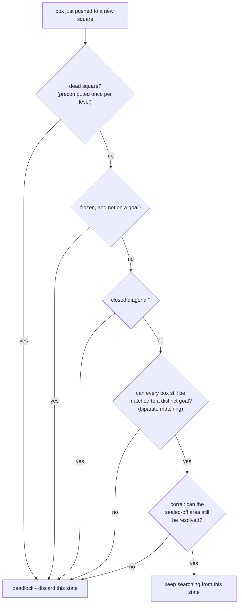

Deadlocks are the main reason Sokoban is hard. Efficient solvers invest a lot of logic into detecting and avoiding them.

A **deadlock** is a state from which no solution exists, even though boxes might still move.

A solver checks for deadlocks in roughly the order below - cheapest and most common cases first, so
that the obviously-fine positions (the vast majority) are decided fast, and only the ones that survive
every cheap check pay for the expensive, search-based ones at the end.

## Basic deadlock types

### Simple deadlocks (dead squares)

A **dead square** is a board tile such that any box pushed onto it can never reach a goal.

Classic examples: boxes in corners or against walls where all goals are elsewhere.

- These squares can be precomputed by *reverse* reachability:
    - Place a single box on each goal and try to pull it backwards through the level.
    - Any floor tile that is never reached by pulling is a dead square.

During search:

- Treat any push that moves a box onto a dead square as **illegal** and skip it entirely.

### Freeze deadlocks

A **frozen box** is a box that has become permanently immovable and is **not on a goal**. A state containing such a box is a **freeze deadlock**.

Typical patterns:

- A box stuck between walls or other boxes so that it can’t move in any direction.
- Chains of boxes that all block each other (“recursive freeze deadlocks”), as in the second example
  below - each box alone looks movable, but together they lock each other in place.

Detection has to be done **dynamically** after each push:

1. After pushing a box, inspect its row and column.
2. If it is blocked on both sides in one direction, and at least one of the blocking lines contains no reachable goal, the box is frozen.
3. If any non-goal box is frozen, the state is a deadlock and can be discarded.

### Dead-and-frozen-box deadlocks

Sometimes a box frozen on a goal can still cause a deadlock because it blocks access to other goals. These need more global patterns, but the idea is similar: identify static structures where one “correct” box placement makes other goals unreachable.

### Bipartite-matching deadlocks

Even when no single box looks frozen, the position can still be unsolvable as a whole: if there is no
way to assign every box to a *different* goal it could still reach (a **perfect matching** between
boxes and goals), then someone is left without a reachable goal, however the boxes are pushed from here.

This is checked with a bipartite matching algorithm (e.g. the Hungarian algorithm, the same one used for
the [heuristic lower bound](./search-and-heuristics.md#minimum-cost-matching-hungarian-algorithm)) between
boxes and the goals each one can still reach - "no perfect matching" means "deadlock", regardless of how
open the board still looks.

### Closed diagonal deadlocks

Two boxes standing diagonally to each other can lock each other in place even though neither is
directly against a wall on both sides: each box's only remaining pushable direction is blocked by the
other box sitting diagonally next to it.

This is a narrower, cheaper special case of the general freeze check above, worth its own fast test
because the pattern (two boxes, one square apart on both axes) is easy to recognize directly.

## Corrals and zones

A **corral** is an area of the board surrounded by walls and boxes that the player cannot enter.

- Inside a corral, boxes can only be moved by pushes from the boundary.
- Corrals can be used for **PI-corral pruning**, which detects regions where every possible move worsens the situation and can be cut off from the search.

More generally, solvers may partition the board into **zones** separated by box “barriers” and reason about connectivity and reachability between them.

## Deadlock tables and pattern-based pruning

Some approaches pre-compute large **deadlock tables** via retrograde analysis: they search backward from solved positions and record which box configurations are solvable. All other patterns in that area are treated as deadlocks.

Trade-offs:

- Greatly reduces nodes during actual solving.
- Requires heavy precomputation time and memory.
- Usually specific to a particular level or room layout.

Junghanns’ Rolling Stone work shows how such deadlock tables, combined with IDA\*, can significantly prune the state space, but also discusses their limitations and open problems.

## Practical deadlock implementation strategy

For a first solver implementation:

1. **Pre-compute simple dead squares** via pull-based analysis.
2. Implement **freeze deadlock detection** that runs after every push.
3. Store any detected deadlock states in a **deadlock table**, so repeating patterns can be recognized in O(1).
4. Only after these basics work well, consider:
    - Corral / zone analysis
    - Pattern-based deadlock tables
    - More complex goal-room reasoning

Even basic deadlock pruning has a huge impact on performance and is much easier to implement than advanced techniques.
