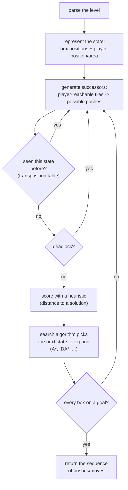

Sokoban is a single-agent puzzle game in which a player pushes boxes in a maze onto goal squares.  
Despite its simple rules, Sokoban is computationally very demanding: it is NP-hard and even PSPACE-complete, and real levels can require hundreds of pushes and have branching factors well over 100.

This makes Sokoban an excellent playground for search algorithms, heuristics, and pruning techniques.

## Goals of this guide

This documentation gives you the practical basics needed to implement your own Sokoban solver:

- How to represent boards and states
- How to generate moves efficiently
- How to apply classic search algorithms (BFS, A\*, IDA\*, …)
- How to design heuristics for Sokoban
- How to detect and prune deadlocks
- How to use more advanced domain-specific techniques

All material is based on:

- The Sokobano “Solver” article (implementation-oriented description of common techniques)
- Research on Rolling Stone, YASS, JSoko, Festival/FESS and others
- Several theses and papers on Sokoban and single-agent search

## What a Sokoban solver actually does

At a high level, a Sokoban solver:

1. **Parses a level** into an internal board representation.
2. **Represents a game state** as:
    - Positions of all boxes
    - Position (or reachability area) of the player
3. **Generates successor states** by:
    - Computing all player-reachable tiles
    - Identifying all pushes that are possible from this state
4. **Searches the state space** using a graph search algorithm
   (usually A\*, IDA\* or a variant).
5. **Uses heuristics** to estimate how far a state is from a solution.
6. **Prunes impossible or obviously bad states**, especially deadlocks.
7. **Keeps track of visited states** in a transposition table to avoid duplicates.
8. **Returns a sequence of pushes/moves** when a goal state is found.

In the following pages we will go through each of these parts in enough detail that you can build a working solver and then iteratively add more sophisticated techniques.

## Going deeper: how SokoLogic actually implements this

Everything above is deliberately generic - it applies to more or less any Sokoban solver. **SokoLogic's
own solver, Socrates,** is a real, concrete implementation of these ideas (plus quite a few techniques
beyond them: a portfolio of several concurrent search strategies, board-symmetry canonicalization, a
learned deadlock-pattern database, Festival-style packing/parking plans). Its contributor documentation
lives next to the code and goes into class names, source files and measured performance, which is more
detail than fits a general guide like this one:

**[→ Socrates developer documentation on GitHub](https://github.com/Megerian/SokoLogic/blob/master/docs/solver/README.md)**
(leaves this site - it is source-adjacent documentation for people modifying the solver, not another
page of this guide)

Start with that document's own `concepts.md` if you want the vocabulary (corral, freeze deadlock,
tunnel, gate position, ...) tied directly to SokoLogic's classes and illustrated with rendered board
pictures, rather than the general description on this page.
