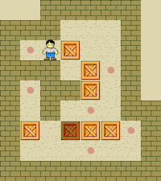

## Rules of the Game

The warehouse is depicted as a grid of squares, each one representing either a floor section or a wall section.

Some floor squares contain boxes and some are marked as storage locations.

The player, often represented as a worker character, can move one square at a time horizontally or vertically onto empty floor squares, but cannot pass through walls or boxes.

To move a box, the player walks up to it and pushes it to the square beyond.

Boxes cannot be pushed to squares with walls or other boxes, and they cannot be pulled.

The number of boxes matches the number of storage locations.

The puzzle is solved when all boxes occupy the storage locations.

An example Sokoban puzzle and how it looks like solving it:

Each step of the player counts as a "move".
Each push of a box counts as a "push".

Some programs display the number of moves and pushes, and the challenge is to complete the level with fewer moves or pushes.
