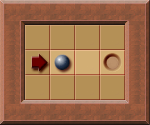

# Deadlocks

Due to the limitation of only being able to push a box, but never pull it, a puzzle can become "deadlocked."

A deadlock occurs when the puzzle cannot be solved, regardless of what the player does. The only way to resolve this is to undo a push or restart the puzzle.

An important observation about deadlocks is that not all boxes in a puzzle need to be involved. A single box in the wrong position can create a deadlock, regardless of the positions of other boxes in the puzzle.

Therefore, it is possible to identify deadlock patterns involving only a few boxes, which is easier than considering all boxes in a puzzle.

This article describes some common types of deadlocks.

In the illustrations below, the player is represented by an arrow, a box by a sphere, and a goal by a small hole.

---

## Dead Square Deadlocks

"Dead square deadlocks" occur when certain squares in a puzzle immediately cause a deadlock if a box is pushed to them.

**Example**:  

In this example, the player can push the box in multiple directions. However, pushing the box onto a darker shaded square immediately results in a deadlock. For instance, if the player pushes the box one square upward, it may still be pushable (left and right), but the box can no longer be moved to the goal.

This deadlock type is considered "simple" because it involves only a single box. Even if the puzzle contains additional boxes, they are irrelevant to this deadlock. Furthermore, simple deadlocks are static. The squares causing the deadlock exist from the start of the puzzle and throughout gameplay. A box on one of these squares will always result in a deadlock.

---

## Freeze Deadlocks

A "freeze deadlock" happens when a box becomes immovable and is not on a goal square. This renders solving the puzzle impossible, as the frozen box prevents progress.

**Example**:  

Here, pushing the box above the player one square upward results in a freeze deadlock. The box cannot be moved further and is not located on a goal square.  

This type of deadlock can occur anytime a box becomes immovable on a square that is not a goal.

**Another Example**:  

In this puzzle, pushing the box to the left creates a freeze deadlock. Although the pushed box reaches a goal, the push immobilizes another box, which eventually causes a box to be frozen in a non-goal position.

---

## Corral Deadlocks

A "corral deadlock" occurs when a specific area becomes inaccessible to the player.

**Example**:  

In this puzzle, the right area (marked with small blue squares) becomes a corral—a region the player cannot reach. If the lower box is pushed to the right, the corral deadlock is formed. While both boxes remain pushable, neither can reach a goal.  

Certain programs, like [Sokoban YASC](http://sourceforge.net/projects/sokobanyasc/), can detect corral deadlocks by determining whether boxes in a corral region can be pushed to goals.  

**Expanded Example**:  

Here, pushing the box one square downward creates a corral deadlock. A box can technically be pushed out of the marked area, but doing so would create another corral deadlock. Thus, the puzzle remains unsolvable.

---

## Closed Diagonal Deadlocks

"Closed diagonal deadlocks" occur when diagonal moves create an unsolvable situation.

**Example**:  

In this case, pushing the box to the left results in a closed diagonal deadlock. This type of deadlock is common in puzzles with checkerboard patterns, such as [Sasquatch V-50](http://sokobano.de/results/display.php?set=sasquatch5&lvl=49).

**Variation Example**:  

If walls are added in specific positions along the diagonal, the resulting closed diagonal deadlock still occurs.

---

## Bipartite Deadlocks

"Bipartite deadlocks" arise when not every box can be pushed to every goal, making it critical to match specific boxes to specific goals.

**Example**:  

Pushing the box to the right creates a bipartite deadlock. Although all boxes remain pushable, it becomes impossible to push all the boxes to goals simultaneously.

---

## Deadlocks Caused by Frozen Boxes

While frozen boxes do not themselves create freeze deadlocks when placed on goals, their presence may still prevent other boxes from being pushed to goals.

**Example**:  

In this scenario, pushing the box next to the player to the right freezes it in a position that blocks another box from reaching its goal. This results in a deadlock.

---

## Detecting and Avoiding Deadlocks

There are many other possible types of deadlocks in Sokoban, often involving combinations of deadlock patterns. Recognizing deadlocks is essential for both human players and automated solvers.

Programs like [Sokoban YASC](http://sourceforge.net/projects/sokobanyasc/) can help players detect certain deadlocks. However, most deadlocks remain undetected by current tools, requiring careful planning and observation to avoid.