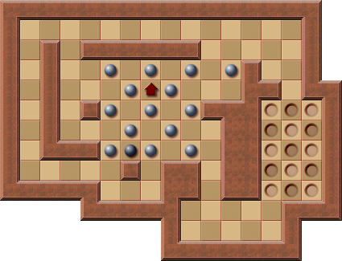

# Moves Parity

The parity of the number of moves in a solution depends on the position of the player when the level has been solved.

## Example

In this level, the move parity is always **even** when the level has been solved, no matter how the player is moved, since the player must always end at the position left of the box.

The reason for this is that the player can only move up, down, left, and right:

In the above image, the squares are alternately colored (checkerboard pattern).  
With every move, the player moves to a square of the other color, no matter how the player moves.  
This means all darker squares are reached with an odd number of moves, and all brighter squares are reached with an even number of moves.

Since the player start position is fixed for every level, the move parity only depends on the **end position** of the player.

This information is sometimes useful, as for certain levels it may help determine where the player finished.

### Example: Original Level 12

The best-known solution for this level contains **601 moves**.  
Since the player starts on a darker square, they must end on a lighter square for the total number of moves to be odd.

Given this, the **last push** of a solution having an odd number of moves is known, as there is only one square on which the player can end when the level is solved.

---

# Pushes Parity

The number of pushes needed to solve a specific Sokoban level is always either **odd** or **even**.

This property can be explained by alternately coloring the squares:

## Key Points

1. With every push, the boxes move to a square of the other color, no matter the direction in which they are pushed.
2. Adding walls to the level does not change this property.
3. A box starting on a darker square can reach:
    - A darker goal square with an **even** number of pushes.
    - A lighter goal square with an **odd** number of pushes.

In this example, at least one box must be pushed to a goal of a different color than its starting position. Hence, the total number of pushes required to solve the level must be **odd**.

## Applications in Solvers

This property of Sokoban solutions can be leveraged in Sokoban solvers:  
A solver that searches for a solution with the fewest number of pushes can **increase the search depth by 2** each time no solution is found for the current depth, provided the parity of the solution is calculated in advance.