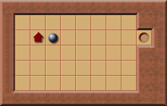
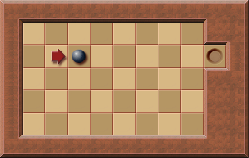
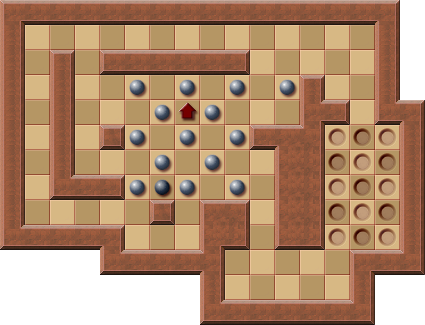
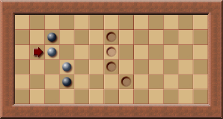

# Moves Parity

The parity of the number of moves required to solve a Sokoban puzzle (i.e., whether it is even or odd) depends on the player's final position when the puzzle is solved.

## Example

In this puzzle, the move parity is always **even** when the level is solved, regardless of how the player moves, because the player must always finish at the position left of the goal.

This phenomenon stems from the fact that the player can only move up, down, left, or right:

In the above image, squares are alternately colored in a checkerboard pattern.  
With each move, the player shifts to a square of the opposite color.  
- All **darker squares** are reached after an **odd** number of moves.  
- All **brighter squares** are reached after an **even** number of moves.  

Since the player's starting position is fixed for each puzzle, the number of moves a solution requires depends only on the **end position** of the player.

This information is valuable for specific puzzles, as it helps deduce where the player must finish in a valid solution.

### Example: Original Puzzle 12

For this puzzle, the best-known solution involves **601 moves**.  
Here, the player starts on a darker square, meaning they must finish on a brighter square to achieve an **odd** total number of moves.

From this, the **last push** of any solution with **odd moves** can be predicted, as only one valid ending square exists for the player upon solving the puzzle.

---

# Pushes Parity

The number of pushes required to solve a Sokoban puzzle is also always either **odd** or **even**.

This property can be visualized by alternately coloring the squares:

## Key Points

1. When a box is pushed, it always moves to a square of the **opposite color** from where it started, regardless of the direction of the push.
2. Adding walls to the puzzle does not affect this property.
3. A box starting on a:
   - **Darker square** can land on:
     - A **darker goal square** (with an **even** number of pushes).
     - A **brighter goal square** (with an **odd** number of pushes).
   - **Brighter square** follows the same rule in reverse.

In any valid solution, at least one box must move to a goal of a different color than its starting square.  
Thus, the **total number of pushes required to solve the puzzle must match the appropriate parity**.

## Applications in Solvers

The parity property can significantly optimize Sokoban-solving algorithms.  
A solver searching for the minimal number of pushes can **increase the search depth by 2** when no solution is found for the current depth, provided the parity of the solution is known beforehand.

For example:
- If the target solution requires an **odd number of pushes** but the depth being explored is currently even, the solver can skip these configurations entirely.  

By leveraging parity, solvers can eliminate invalid configurations in advance, improving both efficiency and accuracy.