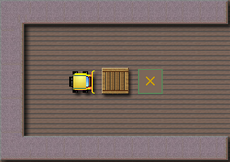
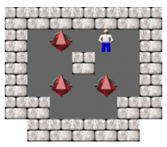
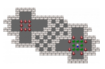
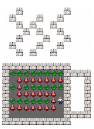
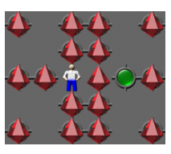
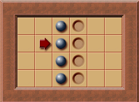
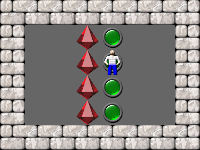

# Sokoban Puzzle Format Details

## Puzzle Representation

A Sokoban puzzle is usually represented using specific characters for each element of the game:

| Puzzle Element        | Character  | ASCII Code |
| --------------------- | ---------- | ---------- |
| Wall                  | `#`        | 0x23       |
| Player                | `@`        | 0x40       |
| Player on Goal Square | `+`        | 0x2b       |
| Box                   | `$`        | 0x24       |
| Box on Goal Square    | `*`        | 0x2a       |
| Goal Square           | `.`        | 0x2e       |
| Floor                 | `(Space)`  | 0x20       |

### Example: Simplest Solvable Puzzle

The simplest possible solvable puzzle is represented as follows:
```
#####
#@$.#
#####
```

It's important that the whole puzzle is surrounded by walls (`#`).

This means, assuming all boxes are removed from the board, the player must not be able to get to the border of the puzzle. Hence, a puzzle like the one shown below can't be loaded by most Sokoban programs because the player can reach the right border (the puzzle is not "closed"):



## Formats Not All Programs Support

Over the years, some Sokoban programs have added support for formats that aren't recognized by many older programs.

### Circular Puzzles

Circular puzzles are puzzles that start in what would normally be the end position.

Example puzzle:



The Sokoban program implementing this puzzle type must ensure that at least one push is made to report "solved" for such puzzles.

> **Note:**
> When implementing a solver, it's important to use special logic for circular puzzles. Usually, a solver avoids duplicate states (i.e., all boxes at the same positions and the player having the same reachable positions). However, in circular puzzles, it is important that the initial state can be reached again.

### Puzzles with Decorative Outside Elements

Some puzzles have walls, boxes, and goals outside the player's reachable area to create a better visual appearance.

An example is "Sasquatch 01 / Level 41":



The boxes on the left side cannot be reached by the player; this entire area serves a decorative purpose. Some programs support loading and playing these puzzles. If the outside elements are not all boxes on goals, the behavior is unclear. Some programs refuse to load such puzzles since the number of goals and boxes does not match. However, other programs consider and count only the **reachable** boxes and goals, ignoring the others.

### Interior Empty Rows

Some puzzles look better with interior empty rows. An example is the puzzle "Steaming Hot" by David Buchweitz:



> **Note:**
> Since an empty line in the `.sok` format is used to separate puzzles, solutions, snapshots, etc., such interior empty rows cannot be written as a completely empty line.
> The rule is: "An empty interior row is written with at least one `-` or `_`."

The puzzle "Steaming Hot" can therefore be stored in a `.txt` file like this:

```
#      #
 #   #  #
  # #  #
   # #  #
  #   #  #
 #   #  #
  # #  #
-
##########
#........####
# $$$$$$$#  #
#.$......#  #
# $$$$$$ #  #
#......$+#  #
#$$$$$$$ #  #
#        ####
##########
```

### Not Closed Puzzles

Some websites and programs also allow puzzles that aren't completely surrounded by walls. The player can move to the border of such puzzles but not further. In extreme cases, such a puzzle might not have any walls at all.

An example is the puzzle "No walls" created by Rincewind:



This puzzle type is supported by very few Sokoban implementations and is not standard. There are only a few puzzles of this type.

## Solution

A solution to a puzzle is represented by the player's moves. The player can move up, down, left, or right. The letters for these directions are: `u`, `d`, `l`, `r`.

A possible solution string might look like this:
`DDrdrruLruLLDllU`

The uppercase letters in this solution indicate that a box is being pushed as the player moves. This information is usually stored in a solution, although the solution is still correct if all letters are lowercase.

> **Note:**
> Although it's common to use the letters **n**orth, **s**outh, **e**ast, and **w**est in other games, the letters `u`, `d`, `l`, and `r` have become the standard for Sokoban directions. The letters `n` and `s` are used instead for the additional directions in the Sokoban variations Hexoban and Trioban, and `n`, `s`, `e`, and `w` are used for the additional directions in Octoban.

Some programs allow playing a puzzle in reverse mode. The puzzle is displayed with all boxes on goals, and the player can pull the boxes. This way, it's sometimes easier to determine the push sequence needed to solve a puzzle when playing forward.

Reverse solutions and snapshots must start with: `[]`.
Hence, a valid reverse solution for this puzzle:



would be: `[]urLdrLdrLdrL`

Note that in a reverse solution, the pulls ***must*** be written with capital letters.

Since the player may be in different areas at the end of the puzzle, the start position in reverse mode is not known when reverse mode is used. It's therefore possible for the player to "jump" to the start position before the first pull is made.

For instance, in this example puzzle:



the player starts at a goal. Since reverse mode starts with all boxes on a goal, the player would start "above" a box. Hence, the player must "jump" to any valid start position (a square without a wall and box).

The jump moves must be written inside the brackets. A valid reverse solution for that puzzle with initial jump moves is:
`[dr]RulUrddllldLuuurLdrLdrrrDluLL`

## Snapshot

It's also possible to save the player's moves even if they don't constitute a solution for the puzzle. In this case, these moves are called a "snapshot." The only difference between a solution and a snapshot is that the moves of a snapshot don't result in a solved state of the puzzle.

## Puzzle Collection

Many authors publish several puzzles as a collection, for instance, the "Sokoban Perfect" collection. Usually, all puzzles contained in this collection are then referred to as "the Sokoban Perfect puzzles."

A specific puzzle from this collection is specified by adding the number of the puzzle in that collection after the collection name. For instance, to refer to the 10th puzzle of the collection "Sokoban Perfect," one can write: "Sokoban Perfect #10" or simply "Sokoban Perfect 10." If the puzzles don't have their own titles, they are just numbered (1, 2, 3, ...). However, some authors also name their puzzles.

## Puzzle File Format

There exist various file formats for storing the data of a puzzle or puzzle collection. The most common file extensions are: `.sok`, `.xsb`, and `.txt`.

Every file format stores the data differently. Some store all data in just one file, while others store different data in different files (for instance, solutions may be saved in extra files for every puzzle).

The widely used `.sok` format is [described here](http://sokobano.de/wiki/index.php?title=Sok_format), including a detailed description of how to implement a program that can read the format.

## Run Length Encoding (RLE)

The XSB format with RLE is more compact and efficient on mobile devices (like Palm, PocketPC, Smartphones) and is smaller for sending via SMS. It can be used for both puzzles and solutions.

In this format, digits show how many elements of the same type are following. For example, `####` becomes `4#`.

This puzzle ("Claire", by Lee J Haywood):

```
#######
#.@ # #
#$* $ #
#   $ #
# ..  #
#  *  #
#######```
```

run-length encoded looks like this:

```
`7#|#.@-#-#|#$*-$-#|#3-$-#|#-..--#|#--*--#|7#`
```

The rows of the puzzle are separated by `|`. There was a discussion in the [Yahoo Group](http://games.groups.yahoo.com/group/sokoban/) in May 2006 about what character should represent an empty square. Finally, the hyphen (`-`) was elected as the standard. Nevertheless, programs are encouraged to support both hyphens and underscores (`_`).

If only two puzzle elements are grouped together, they may be run-length encoded but don't have to be. Example: `$$` may remain `$$` or be encoded as `2$`.

It's recommended to write run-length encoded boards in a single line because some programs may not currently handle RLE boards spanning multiple lines. Most editor programs (for instance, "Notepad" in Windows) have automatic line wrapping, so there is no need for manually creating new lines. However, when an RLE board spans multiple lines, the trailing `|` on each line may be omitted.

In the RLE format, empty squares at the end of a row should be omitted.
For example, this puzzle:

```
###__  <- two empty squares / spaces at the end of the row
#.###
#*$ #
# @ #
#####
```

Should be RLE'd this way:
**`3#`**`|#.3#|#*$-#|#--@#|5#`

> **Note:**
> The RLE format is not used anymore, since the nowadays widely used `.sok` format is compact and efficient enough.

## Exchange of Sokoban Puzzles in E-mails

Many e-mail servers strip empty spaces and multiple spaces. To ensure puzzles can be imported properly by email recipients, here are some suggestions:
Replace all spaces with hyphens (`-`) (preferred) or underscores (`_`).

(Recipients of your mail will have to transpose them back to spaces to import the puzzles into their Sokoban programs, although some Sokoban programs will perform this transposition automatically.)

## Sok Format Description

There is a dedicated page explaining the widely used [Sok-format](sok-format.md) and its implementation in computer programs.